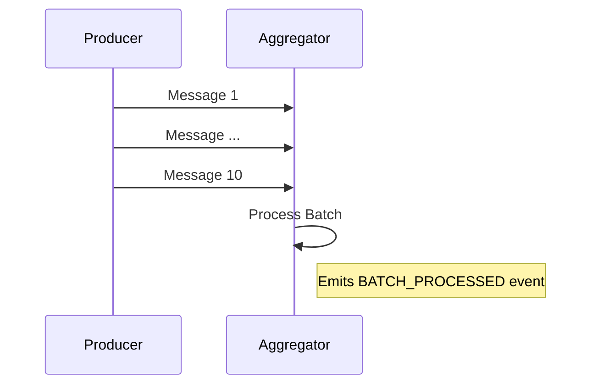

# Flow 2: Batching

## Business Logic
A `Producer` emits traffic messages consistently at a high rate. An `Aggregator` node ingests these streams and buffers them. Once it reaches a designated volume (10 messages in this scenario), the Aggregator processes and flushes the buffer collectively, emitting a consolidated summary matrix.

## Sequence Diagram



## Payload Schema
The final batch event emitted by the aggregator looks like:
```json
{
  "timestamp": "1775510497695",
  "correlation_id": "31133dc24-6b53-2dde-8ac1-508ed62e9d3",
  "flow_id": "FLOW-02-BATCHING",
  "service": "aggregator",
  "event": "BATCH_PROCESSED",
  "payload": {
    "batch_size": 10
  }
}
```

## Troubleshooting (Chaos Mode)
There is no explicit chaos logic implemented for Flow 2 natively. In generic disruption scenarios, monitoring systems should verify whether intermediate messages are mapped correctly back to the eventual `BATCH_PROCESSED` event regardless of batching delays.
