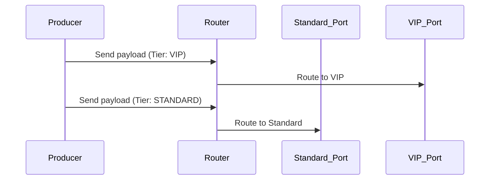

# Flow 5: Conditional Router

## Business Logic
Simulates Layer-7 API routing metrics. A central `Router` evaluates an inbound message tag `{"tier": "STANDARD" | "VIP"}` and bridges it dynamically to designated `std_port` or `vip_port` ZeroMQ conduits strictly based on the content mapping.

## Sequence Diagram



## Payload Schema
```json
{
  "timestamp": "1775510497579",
  "correlation_id": "878277498-7a00-4b04-9f17-f82a745cce0",
  "flow_id": "FLOW-05-ROUTER",
  "service": "router",
  "event": "ROUTED_VIP",
  "payload": {
    "tenant_id": "A123",
    "tier": "VIP",
    "value": 12
  }
}
```

## Troubleshooting (Chaos Mode)
Under `--chaos=true`, the router dynamically fails its condition check. Randomly (~10% threshold), the memory register corrupts, forcefully routing a `VIP` authenticated message object exclusively through the `STANDARD` port bandwidth logic. Monitoring tools should raise violations because `ROUTED_STANDARD` was emitted for a schema displaying `"tier": "VIP"`.
