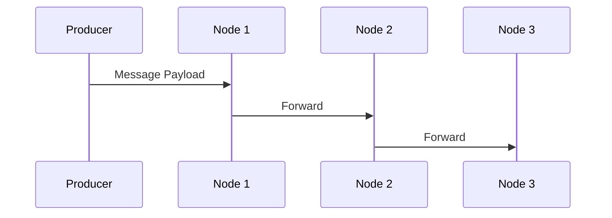

# Flow 7: Data Corruption

## Business Logic
Enacts an integration topology where a message propagates structurally through an unbroken mesh (`Node1` -> `Node2` -> `Node3`). The integrity relies on contextual data fields being securely forwarded through every buffer chain intact.

## Sequence Diagram



## Payload Schema
```json
{
  "timestamp": "1775510497579",
  "correlation_id": "8fa5f1564-f951-ec8a-affe-5e3c92d9268",
  "flow_id": "FLOW-07-CORRUPTION",
  "service": "node3",
  "event": "FORWARDED",
  "payload": {
    "tenant_id": "A123",
    "value": 90
  }
}
```

## Troubleshooting (Chaos Mode)
Injected `--chaos=true` strictly into `Node 2` simulates intermediate process corruption. Upon ingesting a message, `Node 2` proactively erases and shreds the exact `tenant_id` field from the inner `payload` JSON prior to committing the forward buffer pipeline to `Node 3`. Monitoring architectures must utilize JSON validation checks to catch structural violations instantly without halting the physical mesh.
