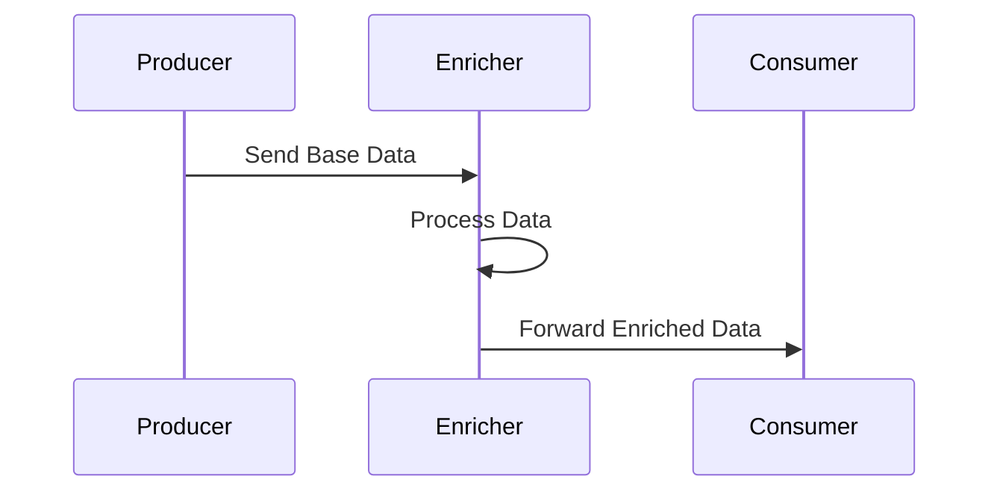

# Flow 1: Happy Path

## Business Logic
This is the baseline sanity check flow. A `Producer` generates a message and sends it to an `Enricher` which appends or validates data before sending it to the final `Consumer`. It ensures standard Push/Pull bindings function without any disruptions.

## Sequence Diagram



## Payload Schema
```json
{
  "timestamp": "1775510497579",
  "correlation_id": "87b736dae-15f1-f85f-a6b3-52d14700803",
  "flow_id": "FLOW-01-HAPPY-PATH",
  "service": "producer",
  "event": "MESSAGE_SENT",
  "payload": {
    "tenant_id": "A123",
    "value": 35
  }
}
```

## Troubleshooting (Chaos Mode)
*Note: The `--chaos` flag has no deliberate effect on Flow 01. It is designed to be the baseline control group metric representing a 100% success rate.*
