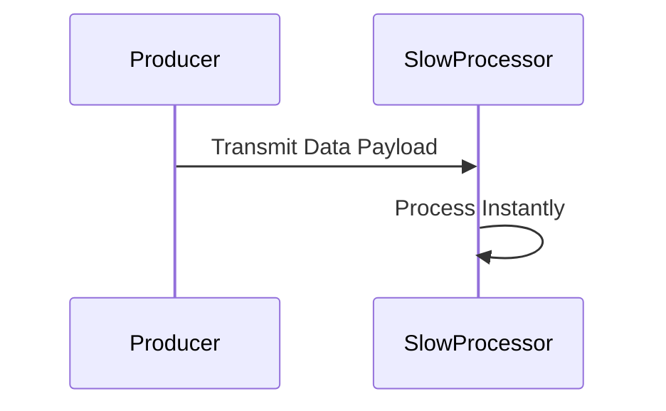

# Flow 3: Latency

## Business Logic
Simulates external delays and network congestion. A `Producer` relays rapid traffic to a `SlowProcessor` node. Under optimal limits, it answers sequentially without delay.

## Sequence Diagram



## Payload Schema
```json
{
  "timestamp": "1775510497579",
  "correlation_id": "a52ae15b9-16c6-21e4-3987-78f9bf77060",
  "flow_id": "FLOW-03-LATENCY",
  "service": "slowprocessor",
  "event": "PROCESSED_SLOWLY",
  "payload": {
    "tenant_id": "A123",
    "value": 45
  }
}
```

## Troubleshooting (Chaos Mode)
If `--chaos=true` is enabled, the `SlowProcessor` invokes computational hibernation (`std::this_thread::sleep_for`) for 2 seconds randomly across ~5% of its traffic before emitting its log. Monitoring systems must detect and alert these 2s spikes on exactly those individual message flows, identifying them as P95+ processing duration outliers.
