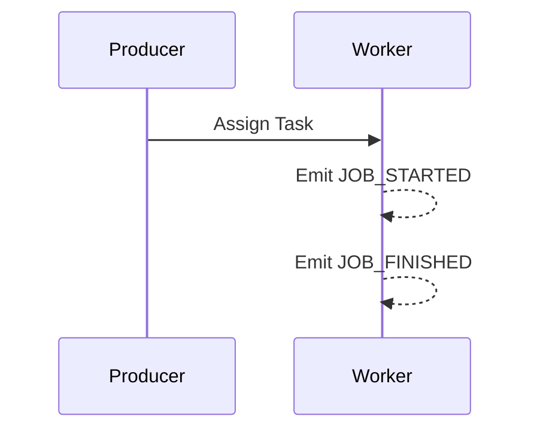

# Flow 4: Orphan Timeout

## Business Logic
Simulates a typical task execution flow. A `Worker` receives a task execution signal. Upon initiation, it emits a `JOB_STARTED` event. Upon conclusion, it must guarantee the emission of a `JOB_FINISHED` event.

## Sequence Diagram



## Payload Schema
```json
{
  "timestamp": "1775510497579",
  "correlation_id": "3b903ba9c-cc19-33b9-c805-006c85a34b2",
  "flow_id": "FLOW-04-ORPHAN",
  "service": "worker",
  "event": "JOB_STARTED",
  "payload": {}
}
```

## Troubleshooting (Chaos Mode)
When instructed with `--chaos=true`, the Worker node acts catastrophically independently around 10% of the time, dropping execution entirely before the `JOB_FINISHED` sequence is reached. Any monitoring suite should effectively tag the unclosed `JOB_STARTED` flow as an "Orphan" timeout error automatically to identify dropped compute instances.
