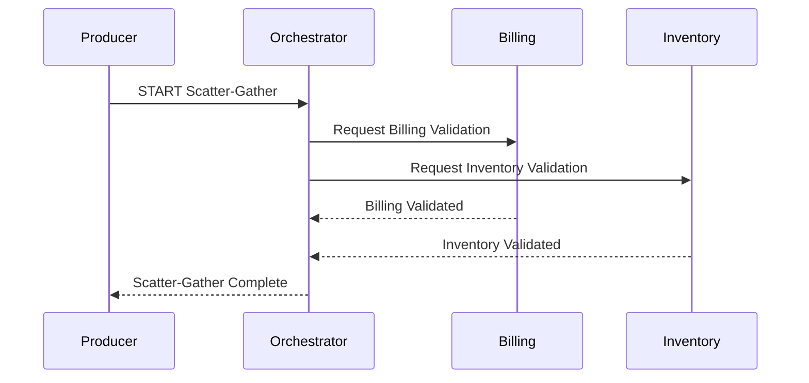

# Flow 6: Scatter-Gather

## Business Logic
The Orchestrator receives an external request and in turn sends concurrent requests to `Billing` and `Inventory`. It awaits a successful response from both before compiling the final result.

## Sequence Diagram



## Payload Schema
```json
{
  "timestamp": "2026-04-06T23:01:49",
  "correlation_id": "uuid-here",
  "flow_id": "FLOW-06-SCATTER-GATHER",
  "service": "orchestrator",
  "event": "SCATTER_REQUEST",
  "payload": {
    "user_id": "123",
    "item_id": "456",
    "amount": 100
  }
}
```

## Troubleshooting (Chaos Mode)
If `--chaos=true` is passed to the orchestrator, it will intentionally proceed without waiting for the `Billing` node to respond, causing an incomplete assembly of data. This will trigger a deliberate failure case to observe incomplete results.
